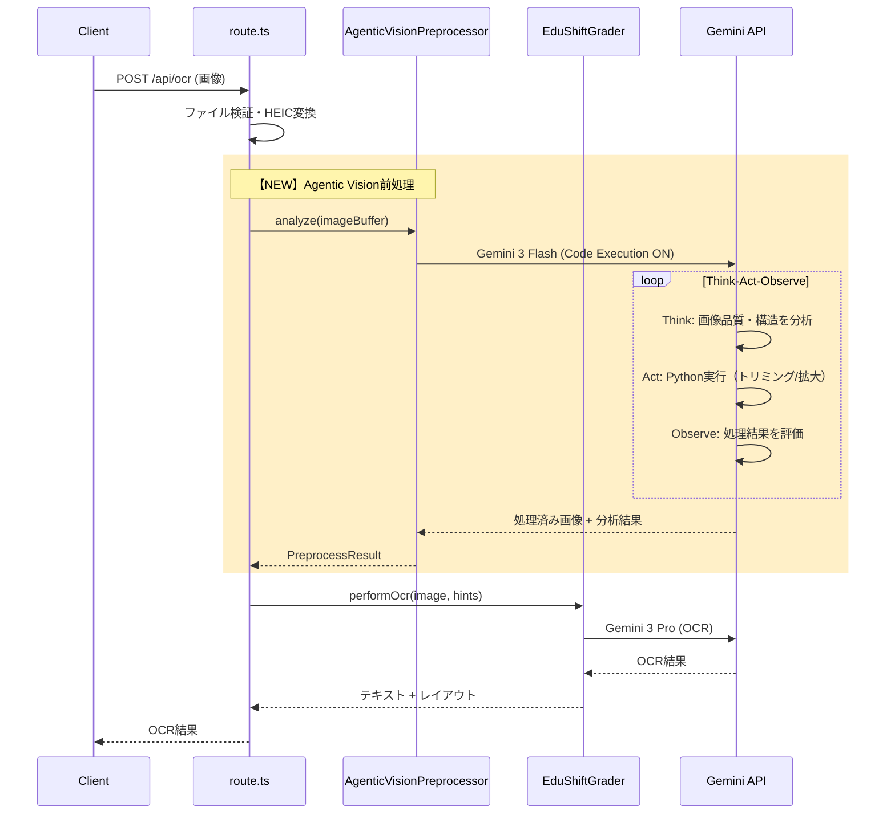

# Agentic Vision 統合設計書

## EduShift Auto-Tensaku System × Gemini 3 Flash Agentic Vision

**作成日**: 2026-01-30
**バージョン**: 1.0
**ステータス**: Draft

---

## 1. 概要

### 1.1 目的

EduShiftの記述答案自動採点システムにおける**手書き文字認識（OCR）精度の向上**を目的として、Google Gemini 3 FlashのAgentic Vision機能をOCR前処理として導入する。

### 1.2 背景・課題

現在のシステムでは以下の課題が存在する：

| 課題 | 詳細 | 影響 |
|------|------|------|
| **手書き文字の誤認識** | 生徒の急いで書いた字、癖字が正しく読み取れない | 採点精度の低下、ユーザー不満 |
| **一発勝負のOCR** | 不明瞭な文字も推測で処理、検証なし | 誤読が修正されない |
| **品質フィードバックなし** | 画像品質の問題を事前検出できない | 根本解決の機会損失 |

### 1.3 解決アプローチ

**Agentic Vision**の「Think → Act → Observe」ループを活用し、OCR前に画像を能動的に分析・前処理する。

```
【現状】
画像 → 圧縮 → Gemini OCR (一発) → 採点

【提案】
画像 → 圧縮 → Agentic Vision前処理 → Gemini OCR → 採点
                    ↓
            ・画像品質評価
            ・解答領域の検出・分離
            ・不明瞭箇所の特定・拡大
            ・OCRヒント情報の生成
```

---

## 2. システムアーキテクチャ

### 2.1 全体構成

```
┌─────────────────────────────────────────────────────────────────┐
│                        Client (Next.js)                         │
│  ┌─────────────────────────────────────────────────────────┐   │
│  │  画像アップロード → imageCompressor.ts → API送信        │   │
│  └─────────────────────────────────────────────────────────┘   │
└─────────────────────────────────────────────────────────────────┘
                              ↓ POST /api/ocr or /api/grade
┌─────────────────────────────────────────────────────────────────┐
│                      Server (Vercel Edge)                       │
│  ┌─────────────────────────────────────────────────────────┐   │
│  │  route.ts                                                │   │
│  │  ├── ファイル検証・HEIC変換                              │   │
│  │  ├── 【NEW】AgenticVisionPreprocessor.analyze()         │   │
│  │  └── EduShiftGrader.grade()                             │   │
│  └─────────────────────────────────────────────────────────┘   │
│                                                                 │
│  ┌─────────────────────────────────────────────────────────┐   │
│  │  【NEW】AgenticVisionPreprocessor                        │   │
│  │  ├── Gemini 3 Flash + Code Execution                    │   │
│  │  ├── 画像品質評価                                        │   │
│  │  ├── 解答領域検出                                        │   │
│  │  ├── 難読箇所の拡大・強調                               │   │
│  │  └── OCRヒント生成                                       │   │
│  └─────────────────────────────────────────────────────────┘   │
│                                                                 │
│  ┌─────────────────────────────────────────────────────────┐   │
│  │  EduShiftGrader (既存・一部改修)                         │   │
│  │  ├── performOcr() ← ヒント情報を受け取るよう拡張        │   │
│  │  ├── executeGrading()                                    │   │
│  │  └── ...                                                 │   │
│  └─────────────────────────────────────────────────────────┘   │
└─────────────────────────────────────────────────────────────────┘
```

### 2.2 新規コンポーネント

#### AgenticVisionPreprocessor

**場所**: `/web/src/lib/core/agenticVisionPreprocessor.ts`

**責務**:
1. 画像品質の評価（ぼやけ、暗さ、傾き）
2. 解答領域の検出とバウンディングボックス抽出
3. 低コントラスト・不明瞭箇所の特定
4. OCRエンジンへのヒント情報生成

---

## 3. データフロー

### 3.1 処理シーケンス



### 3.2 データ構造

#### PreprocessResult（前処理結果）

```typescript
interface PreprocessResult {
  /** 処理済み画像（トリミング/強調後） */
  processedImages: ProcessedImage[];

  /** 画像品質評価 */
  quality: {
    blur: number;        // 0-1 (0=クリア, 1=ぼやけ)
    brightness: number;  // 0-1 (0=暗い, 1=明るい)
    tiltDegrees: number; // 傾き角度
    overallScore: number; // 総合スコア 0-100
  };

  /** 検出されたレイアウト */
  layout: {
    type: 'single_column' | 'two_column' | 'grid' | 'mixed';
    answerRegions: BoundingBox[];
    problemRegions: BoundingBox[];
  };

  /** OCRへのヒント情報 */
  hints: {
    /** 難読箇所のリスト */
    lowConfidenceRegions: Array<{
      region: BoundingBox;
      suggestion: string;  // "漢字2文字の可能性", "数字の可能性" など
      zoomedImage?: Buffer; // 拡大画像
    }>;

    /** 推定される文字種 */
    expectedCharTypes: ('kanji' | 'hiragana' | 'katakana' | 'number' | 'alphabet')[];

    /** 特記事項 */
    notes: string[];
  };

  /** 再撮影推奨フラグ */
  retakeRecommended: boolean;
  retakeReason?: string;
}

interface ProcessedImage {
  buffer: Buffer;
  mimeType: string;
  purpose: 'main' | 'zoomed_region' | 'enhanced';
  originalRegion?: BoundingBox;
}

interface BoundingBox {
  x: number;
  y: number;
  width: number;
  height: number;
}
```

---

## 4. API仕様

### 4.1 Agentic Vision API呼び出し

```typescript
// Gemini 3 Flash でAgentic Visionを有効化
const response = await genai.models.generateContent({
  model: 'gemini-3-flash',
  contents: [
    {
      role: 'user',
      parts: [
        { inlineData: { mimeType: image.mimeType, data: image.base64 } },
        { text: AGENTIC_VISION_PROMPT }
      ]
    }
  ],
  config: {
    tools: [{ codeExecution: {} }],  // Code Execution を有効化
    temperature: 0,
    topP: 0.1,
  }
});
```

### 4.2 プロンプト設計

```typescript
const AGENTIC_VISION_PROMPT = `
あなたは手書き日本語答案の画像分析エキスパートです。
以下のタスクを順番に実行してください。

## タスク1: 画像品質評価
Pythonコードを実行して以下を計測：
- ぼやけ度（Laplacian variance）
- 明るさ（平均輝度）
- 傾き（Hough変換またはエッジ検出）

## タスク2: 解答領域の検出
- 解答欄と問題文を分離
- 各領域のバウンディングボックスを特定
- レイアウトタイプを判定（縦書き/横書き/グリッド）

## タスク3: 難読箇所の特定
- コントラストが低い領域を検出
- 文字が密集している領域を検出
- 該当箇所を拡大・強調した画像を生成

## タスク4: OCRヒント生成
- 検出した文字の種類（漢字/ひらがな/数字など）を推定
- 文脈から予測される語彙をリストアップ

## 出力形式
JSON形式で以下を返してください：
{
  "quality": { "blur": 0.0-1.0, "brightness": 0.0-1.0, "tiltDegrees": number },
  "layout": { "type": string, "answerRegions": [...], "problemRegions": [...] },
  "lowConfidenceRegions": [...],
  "expectedCharTypes": [...],
  "retakeRecommended": boolean,
  "retakeReason": string | null
}
`;
```

### 4.3 既存APIの変更

#### /api/ocr エンドポイント

```typescript
// route.ts の変更箇所

import { AgenticVisionPreprocessor } from '@/lib/core/agenticVisionPreprocessor';

// 前処理を追加
const preprocessor = new AgenticVisionPreprocessor();
const preprocessResult = await preprocessor.analyze(uploadedFiles);

// 品質が低い場合は警告を返す
if (preprocessResult.retakeRecommended) {
  return NextResponse.json({
    warning: preprocessResult.retakeReason,
    continueAnyway: true,
    preprocessResult
  });
}

// OCRにヒント情報を渡す
const grader = new EduShiftGrader();
const result = await grader.performOcrWithHints(
  targetLabel,
  preprocessResult.processedImages,
  preprocessResult.hints
);
```

#### EduShiftGrader クラス

```typescript
// grader.ts に追加するメソッド

/**
 * ヒント情報を活用したOCR実行
 */
async performOcrWithHints(
  targetLabel: string,
  images: ProcessedImage[],
  hints: PreprocessResult['hints']
): Promise<OcrResult> {
  // ヒント情報をプロンプトに組み込む
  const enhancedPrompt = this.buildEnhancedOcrPrompt(targetLabel, hints);

  // 難読箇所の拡大画像も一緒に送信
  const allImages = [
    ...images.filter(img => img.purpose === 'main'),
    ...images.filter(img => img.purpose === 'zoomed_region')
  ];

  return await this.runOcrAttempt(enhancedPrompt, allImages, CONFIG.MODEL_NAME);
}

private buildEnhancedOcrPrompt(
  targetLabel: string,
  hints: PreprocessResult['hints']
): string {
  let prompt = this.buildOcrPrompt(targetLabel, 'primary', false);

  // ヒント情報を追加
  if (hints.lowConfidenceRegions.length > 0) {
    prompt += `\n\n## 注意が必要な箇所\n`;
    hints.lowConfidenceRegions.forEach((region, i) => {
      prompt += `- 箇所${i + 1}: ${region.suggestion}\n`;
    });
  }

  if (hints.expectedCharTypes.length > 0) {
    prompt += `\n予想される文字種: ${hints.expectedCharTypes.join(', ')}\n`;
  }

  return prompt;
}
```

---

## 5. 実装計画

### 5.1 フェーズ分け

| フェーズ | 内容 | 期間目安 | 成果物 |
|---------|------|----------|--------|
| **Phase 1** | PoC実装 | 1週間 | スタンドアロンスクリプト |
| **Phase 2** | 統合実装 | 2週間 | AgenticVisionPreprocessor |
| **Phase 3** | 最適化 | 1週間 | パフォーマンス調整 |
| **Phase 4** | 本番リリース | 1週間 | 段階的ロールアウト |

### 5.2 Phase 1: PoC実装

**目標**: Agentic Visionが日本語手書き文字に有効か検証

**タスク**:
1. [ ] Gemini 3 Flash + Code Execution のAPI接続確認
2. [ ] サンプル答案画像での動作検証
3. [ ] 品質評価Pythonコードの精度確認
4. [ ] OCR精度の改善率測定（Before/After比較）

**成功基準**:
- OCR精度が5%以上向上
- 処理時間が現状の2倍以内

### 5.3 Phase 2: 統合実装

**タスク**:
1. [ ] `AgenticVisionPreprocessor` クラス実装
2. [ ] `PreprocessResult` 型定義
3. [ ] `/api/ocr` ルートの改修
4. [ ] `EduShiftGrader.performOcrWithHints()` 実装
5. [ ] エラーハンドリング・フォールバック実装
6. [ ] 単体テスト作成

### 5.4 Phase 3: 最適化

**タスク**:
1. [ ] 処理時間の計測・ボトルネック特定
2. [ ] 不要な前処理ステップの削除
3. [ ] キャッシュ戦略の検討
4. [ ] 並列処理の検討

### 5.5 Phase 4: 本番リリース

**タスク**:
1. [ ] Feature Flag による段階的有効化
2. [ ] A/Bテスト実施
3. [ ] モニタリング・アラート設定
4. [ ] ユーザーフィードバック収集

---

## 6. リスクと対策

### 6.1 リスク一覧

| リスク | 影響度 | 発生確率 | 対策 |
|--------|--------|----------|------|
| **処理時間の増加** | 高 | 高 | タイムアウト設定調整、フォールバック |
| **API コスト増加** | 中 | 高 | 呼び出し条件の最適化、キャッシュ |
| **日本語精度が不十分** | 高 | 中 | PoC で事前検証、プロンプト調整 |
| **Gemini 3 Flash レート制限** | 中 | 中 | 既存フォールバック機構を流用 |
| **Code Execution 失敗** | 低 | 低 | スキップしてOCRのみ実行 |

### 6.2 フォールバック戦略

```typescript
async analyze(images: UploadedFilePart[]): Promise<PreprocessResult | null> {
  try {
    // Agentic Vision 前処理を試行
    return await this.runAgenticVision(images);
  } catch (error) {
    // 失敗時は前処理をスキップ（既存フローにフォールバック）
    console.warn('[AgenticVision] 前処理失敗、スキップします:', error);
    return null;
  }
}
```

### 6.3 コスト管理

| 項目 | 現状 | 導入後予測 | 対策 |
|------|------|-----------|------|
| API呼び出し/採点 | 1回 | 2回 | 品質が良い画像はスキップ |
| トークン消費 | ~5K | ~8K (+3K) | Code Executionの出力制限 |
| 処理時間 | ~120秒 | ~180秒 | 並列化、早期終了条件 |

---

## 7. 成功指標（KPI）

| 指標 | 現状ベースライン | 目標 | 測定方法 |
|------|------------------|------|----------|
| **OCR精度** | 未計測 | +5%以上向上 | テストセットでの文字一致率 |
| **再撮影削減率** | 未計測 | 20%削減 | 品質警告→再撮影→成功の比率 |
| **ユーザー修正率** | 未計測 | 30%削減 | OCR後の手動修正回数 |
| **処理時間** | ~120秒 | <180秒 | APIレスポンス時間 |
| **エラー率** | 未計測 | <1%増加 | 500エラー発生率 |

---

## 8. 今後の拡張可能性

### 8.1 短期（Phase 4完了後）

- **採点結果の可視化**: Agentic Visionで減点箇所をハイライト
- **複数回答の自動分割**: 一枚の画像から複数の解答欄を自動検出

### 8.2 中期（3-6ヶ月後）

- **適応的プロンプト選択**: 画像特性に応じたOCRプロンプトの自動切り替え
- **信頼度スコアの導入**: 文字ごとの認識信頼度を表示

### 8.3 長期（6ヶ月以降）

- **学習フィードバックループ**: ユーザー修正データの収集と改善
- **オフライン対応**: 軽量モデルでのエッジ処理

---

## 付録

### A. 参考資料

- [Introducing Agentic Vision in Gemini 3 Flash](https://blog.google/innovation-and-ai/technology/developers-tools/agentic-vision-gemini-3-flash/) (2026-01-27)
- [Gemini API Documentation](https://ai.google.dev/gemini-api/docs/gemini-3)
- EduShift 既存コードベース: `/web/src/lib/core/grader.ts`

### B. 用語集

| 用語 | 説明 |
|------|------|
| **Agentic Vision** | Gemini 3 Flashの新機能。Think-Act-Observeループで画像を能動的に分析 |
| **Code Execution** | Gemini APIでPythonコードを実行する機能 |
| **OCR** | Optical Character Recognition（光学文字認識） |
| **バウンディングボックス** | 画像内の領域を示す矩形座標 |

### C. 変更履歴

| 日付 | バージョン | 変更内容 | 著者 |
|------|-----------|----------|------|
| 2026-01-30 | 1.0 | 初版作成 | Claude |
